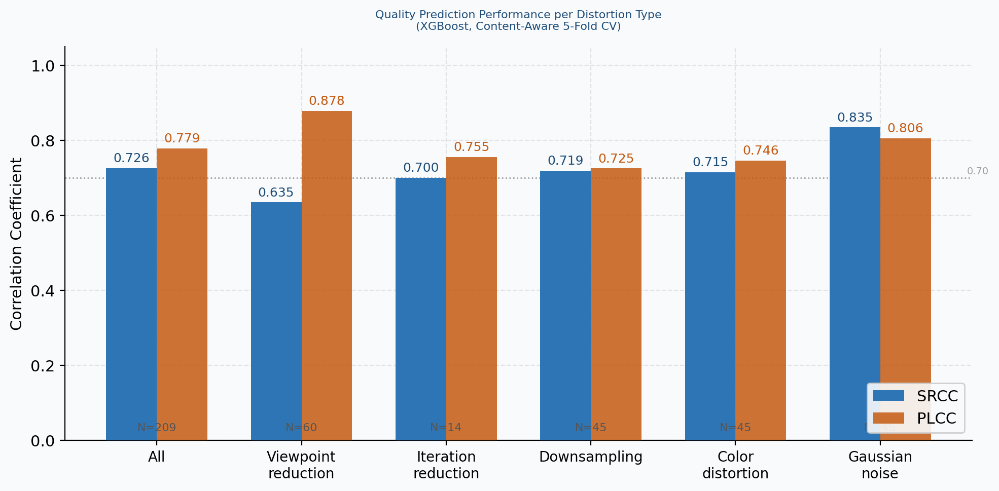
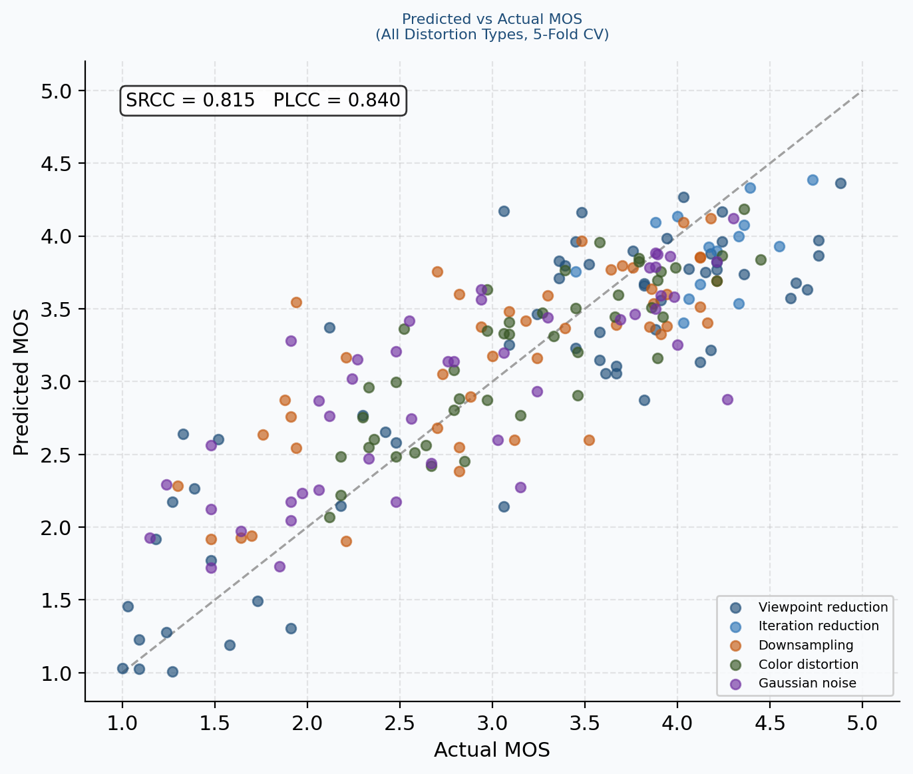
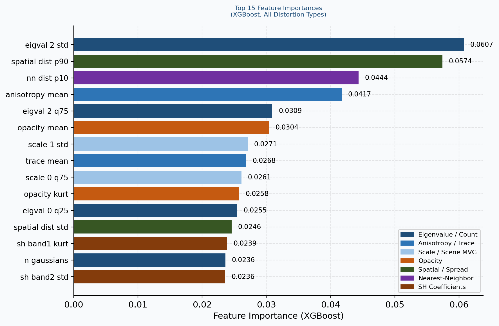
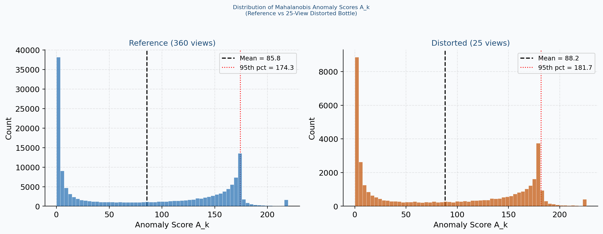
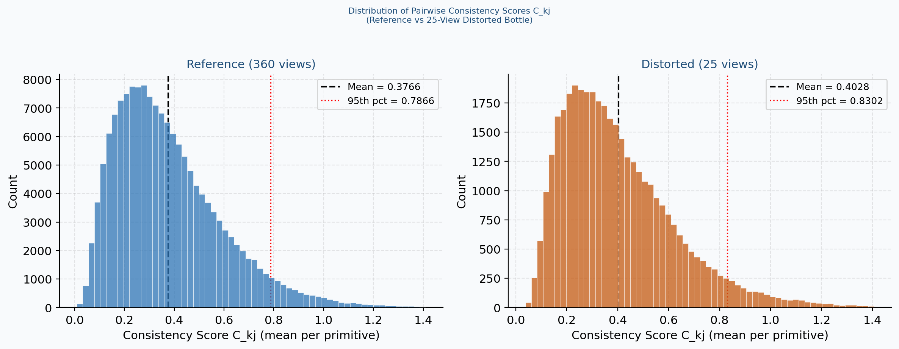
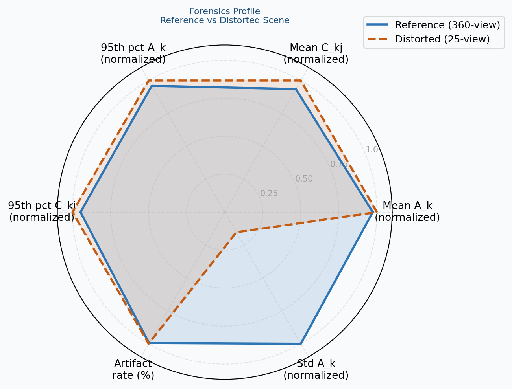

# MCSF-3DGS: Multivariate Covariance-Based Structural Forensics in 3D Gaussian Splatting

<div align="center">


**A no-reference MVG-based diagnostic framework for structural quality assessment and forensics in 3D Gaussian Splatting scenes.**

[Overview](#overview) • [Features](#features) • [Installation](#installation) • [Usage](#usage) • [Results](#results) • [Repository Structure](#repository-structure)

</div>

---

## Overview

3D Gaussian Splatting (3DGS) represents scenes as collections of anisotropic Gaussian primitives, each parameterized by a **3×3 covariance matrix** encoding shape and orientation in 3D space. Standard quality metrics (PSNR, SSIM) evaluate rendered 2D projections and are **structurally blind** to geometric artifacts such as floaters and structural collapse.

This repository implements the **MCSF framework**: an MVG-based diagnostic engine that detects and quantifies structural artifacts **directly in 3D covariance parameter space** — without any rendered reference image.

> This work extends the author's published MVG framework for No-Reference IQA ([Sensors 2026, DOI: 10.3390/s26031002](https://doi.org/10.3390/s26031002)) from 2D satellite imagery to 3D Gaussian primitives.

---

## Features

### 🔬 Forensics Engine
- **Equation 3** — Per-primitive Mahalanobis anomaly score $A_k$
- **Equation 4** — Pairwise covariance consistency score $C_{kj}$
- Floater detection and structural collapse identification
- Reference vs distorted scene comparison

### 📊 Quality Prediction Pipeline
- 98 MVG features extracted per `.ply` file across 11 feature groups
- XGBoost regressor with content-aware 5-fold cross-validation
- Per-distortion-type models (viewpoint, downsampling, color, noise)
- SRCC up to **0.835** on the 3DGS-QA benchmark

### 🧮 Feature Groups
| Group | Features | Description |
|---|---|---|
| Covariance eigenvalues | 18 | Shape distribution statistics |
| Anisotropy | 6 | Gaussian elongation measures |
| Scale distribution | 18 | Primitive size statistics |
| Opacity | 6 | Transparency/floater patterns |
| Spatial density | 6 | Scene compactness |
| Nearest-neighbor distances | 5 | Local structural regularity |
| SH coefficients | 12 | View-dependent color (f_rest_0..44) |
| Gaussian count & density | 4 | Downsampling indicators |
| Color statistics | 9 | DC color distribution |
| Positional noise indicators | 8 | Noise-induced jitter |
| Scene MVG descriptor | 6 | Global covariance fingerprint |

---

## Installation

```bash
git clone https://github.com/bishr-omer/MCSF-3DGS.git
cd MCSF-3DGS

python -m venv venv
venv\Scripts\activate        # Windows
# source venv/bin/activate   # Linux/Mac

pip install numpy scipy scikit-learn xgboost pandas openpyxl matplotlib huggingface_hub
```

### Download Dataset

```bash
python download.py
```

This downloads the [3DGS-QA dataset](https://huggingface.co/datasets/dyn2024/3DGS-QA) (225 scenes, 15 objects, 5 distortion types).

---

## Usage

### Quality Prediction

```bash
python train_predict.py data/model data/3DGS_MOS.csv
```

Runs content-aware 5-fold CV with XGBoost across all distortion types. Reports SRCC, PLCC, RMSE per distortion type.

### Forensics — Single Scene

```bash
python forensics.py data/model/bottle.ply
```

Computes per-primitive anomaly scores $A_k$ and pairwise consistency scores $C_{kj}$, reports floater and structural collapse statistics.

### Forensics — Reference vs Distorted Comparison

```bash
python forensics.py data/model/bottle.ply data/model/bottle_25.ply
```

Compares structural integrity between a full 360-view reconstruction and a sparse 25-view reconstruction.

### Generate Figures

```bash
python generate_figures.py data/model data/3DGS_MOS.csv
```

Generates all 6 report figures into a `figures/` subfolder.

---

## Results

### Quality Prediction (Content-Aware CV, XGBoost)

| Distortion Type | N | SRCC | PLCC | RMSE |
|---|---|---|---|---|
| All combined | 209 | 0.726 | 0.779 | 0.648 |
| Viewpoint reduction | 60 | 0.635 | 0.879 | 0.590 |
| Iteration reduction | 14 | 0.700 | 0.755 | 0.276 |
| Downsampling | 45 | 0.719 | 0.725 | 0.571 |
| Color distortion | 45 | 0.715 | 0.746 | 0.494 |
| **Gaussian noise** | **45** | **0.835** | **0.806** | **0.608** |







### Forensics: Reference vs 25-View Distorted (Bottle Scene)

| Metric | Reference | Distorted | Change |
|---|---|---|---|
| Total primitives | 154,380 | 38,595 | -75.0% |
| Mean $A_k$ | 85.79 | 88.20 | +2.8% |
| Mean $C_{kj}$ | 0.3766 | 0.4028 | **+6.9%** |
| Total artifact rate | 9.72% | 9.77% | +0.5% |

> The pairwise consistency score $C_{kj}$ is more sensitive to viewpoint-induced structural degradation than individual Mahalanobis scoring, detecting discontinuities invisible to standard rendering metrics.







---

## Core Equations

**Mahalanobis Anomaly Score (Equation 3):**

$$A_k = (\mathbf{x}_k - \hat{\mu})^\top \hat{\Sigma}^{-1} (\mathbf{x}_k - \hat{\mu})$$

**Pairwise Covariance Consistency Score (Equation 4):**

$$C_{kj} = \left\| \frac{\Sigma_k}{\|\Sigma_k\|_F} - \frac{\Sigma_j}{\|\Sigma_j\|_F} \right\|_F$$

Where $\mathbf{x}_k$ is the 10-dimensional primitive descriptor (covariance upper triangle + opacity + centroid displacement), and $\hat{\mu}$, $\hat{\Sigma}$ are the reference MVG parameters fitted on high-confidence core primitives.

---

## Repository Structure

```
MCSF-3DGS/
├── extract_features.py    # PLY loader + 98 MVG feature extraction
├── forensics.py           # Mahalanobis A_k + pairwise C_kj engine
├── train_predict.py       # XGBoost pipeline + content-aware CV
├── generate_figures.py    # All report figures
├── download.py            # 3DGS-QA dataset downloader
├── .gitignore
└── README.md
```

> Dataset files (.ply, .csv) are excluded from the repository. Download via `python download.py`.

---

## Related Work

- **MVG-SDI / MVG-Spa** — Author's MSc NR-IQA frameworks for pansharpened satellite imagery: [github.com/bishr-omer](https://github.com/bishr-omer)
- **3DGS-QA Dataset** — Diao et al. (2025): [github.com/diaoyn/3DGSQA](https://github.com/diaoyn/3DGSQA)
- **3D Gaussian Splatting** — Kerbl et al., ACM TOG 2023
- **GSD Pipeline** — Mu, Zuo et al., arXiv:2407.04237

---

## Author

**Bishr Omer**
MSc, Northwestern Polytechnical University (2026)
PhD Applicant, Concordia University (Student ID: 40366261)
[github.com/bishr-omer](https://github.com/bishr-omer)

> *This repository documents preliminary Phase 1 implementation of the MCSF PhD research proposal submitted to Prof. Xinxin Zuo, Concordia University, April 2026.*

---

<div align="center">
<sub>Built on the MVG statistical framework first published in <a href="https://doi.org/10.3390/s26031002">Sensors 2026</a></sub>
</div>
